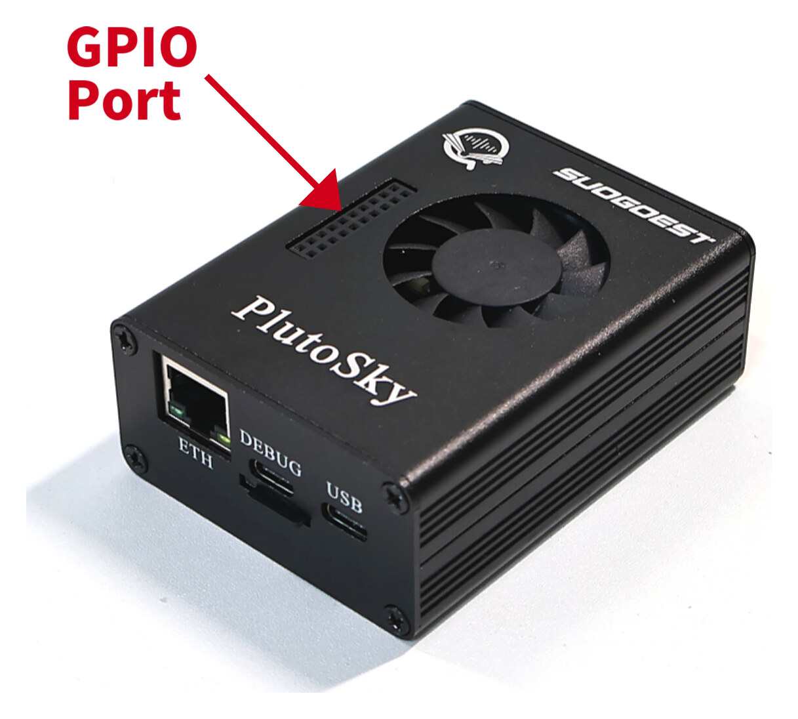
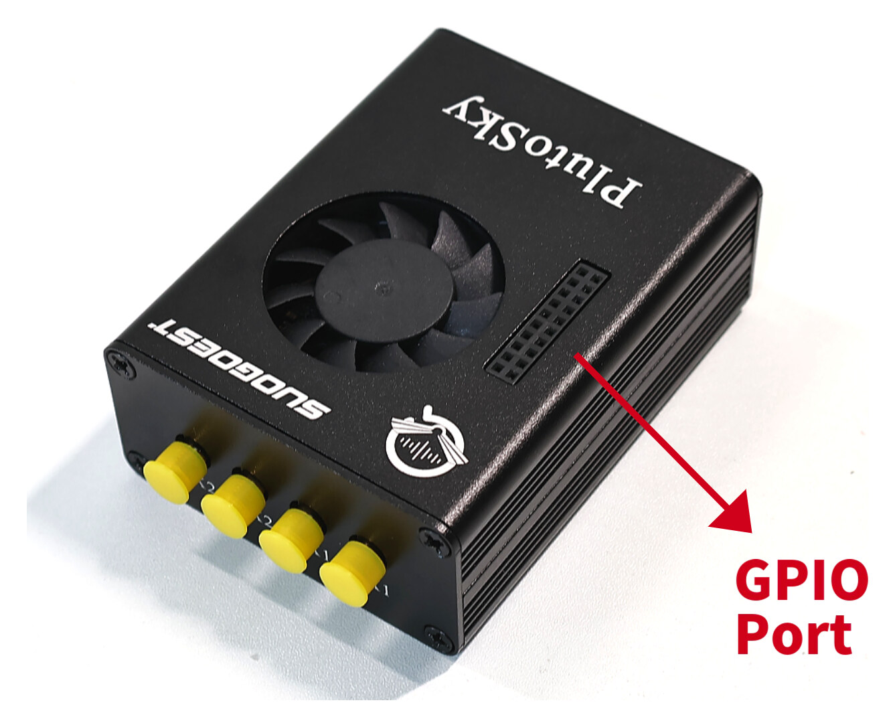

# What is on the board

A reference to the board's main parts, clocks, connectors and supply rails, for
anyone wiring to it, choosing a frequency range, or constraining a pin. Everything
is read off the vendor schematic in
[`docs/vendor/`](vendor/7020_936x_SDR-schematic.pdf) (sheet numbers given) and
cross-checked against a running board where possible.

## What it looks like

Sold bare or boxed. Boxed, as the PlutoSky R1, it is a black aluminium case with a
fan on top: the Ethernet jack and two USB-C sockets at one end, labelled **ETH**,
**DEBUG** and **USB**, the four SMA connectors at the other, and the `JP5` GPIO
header reachable through a slot beside the fan.

<p align="center">
  
  
</p>

Case photos: OpenSourceSDRLab's product pages. The board photo below is the
vendor's too.

## What is where


Solid ring: identified from its marking. Dashed ring, "likely": only the package
and position fit. Regenerated by [`docs/img/make_board_map_svg.py`](img/make_board_map_svg.py).

## The main devices

| Ref | Part | What it does | Sheet | Corroborated by | Datasheet |
|---|---|---|---|---|---|
| `U1` | Xilinx **XC7Z020-CLG400** | Zynq-7000: two Cortex-A9 cores plus Artix-7 fabric | 1, 2, 3, 5, 6 | legible on the package | [DS187](https://docs.amd.com/v/u/en-US/ds187-XC7Z010-XC7Z020-Data-Sheet) · [DS190 overview](https://docs.amd.com/v/u/en-US/ds190-Zynq-7000-Overview) |
| `U2` `U3` | Micron **MT41K256M16TW-107IT:P** | DDR3L, 4 Gbit ×16 each, so **1 GB** across a 32-bit bus | 3 | Micron logo and FBGA code `D9SHD` legible; board reports `MemTotal: 1027848 kB` | [Micron part page](https://www.micron.com/products/memory/dram-components/ddr3-sdram/part-catalog/part-detail/mt41k256m16tw-107-it-p) |
| `U11` | Analog Devices **AD9361** | the radio: 2×2 transceiver, 70 MHz – 6 GHz | 10, 11, 12 | ADI logo legible; `ad9361-phy` in IIO | [AD9361](https://www.analog.com/media/en/technical-documentation/data-sheets/ad9361.pdf) |
| `U12` `U13` | Mini-Circuits **PGA-102+** | transmit power amplifier, one per channel | 12 | SOT-89 packages beside the outer SMA ports; self-test measures ~15.7 dB of gain at 900 MHz | [PGA-102+](https://www.minicircuits.com/pdfs/PGA-102+.pdf) |
| `T1`–`T4` | RF baluns (the schematic gives no part number) | single-ended SMA ↔ the AD9361's differential RF pins, one per port. On transmit the balun is **before** the amplifier: `AD9361 TX1A_P/N → T1 → TX1A_I → U12 → TX1A_O → SMA` | 12 | four square 6-pad parts around the AD9361; pads labelled `PRIMARY`, `PRIMARY_DOT`, `SECONDARY_DOT`, `NOT_USED`, `GND`, a transformer footprint with polarity dots | — |
| `U8` | FTDI **FT2232HL** | USB to JTAG *and* serial console, on one socket | 8 | two `ttyUSB` ports enumerate together | [FT2232H](https://ftdichip.com/wp-content/uploads/2024/09/DS_FT2232H.pdf) |
| `U9` | Microchip **USB3320C-EZK** | USB 2.0 OTG PHY | 9 | the `usb0` network interface | [USB3320](https://ww1.microchip.com/downloads/en/DeviceDoc/00001792E.pdf) |
| `IC2` | Realtek **RTL8211F-CG** | gigabit Ethernet PHY | 4 | Realtek logo legible; `eth0` | [Realtek product page](https://www.realtek.com/Product/Index?id=3975&cate_id=786) |
| `RJ1` | HanRun **HR911130A** | RJ45 with integrated magnetics | 4 | legible on the part | [LCSC page, with datasheet](https://lcsc.com/product-detail/Ethernet-Connectors-Modular-Connectors-RJ45-RJ11_HANRUN-Zhongshan-HanRun-Elec-HR911130A_C54408.html) |
| — | Winbond **W25Q128JVSIQ** | 16 MB QSPI flash: FSBL, U-Boot, its environment, a small Linux image | 2 | four MTD partitions totalling 16 MB | [W25Q128JV](https://www.winbond.com/resource-files/w25q128jv%20revf%2003272018%20plus.pdf) |
| `IC1` | onsemi **MAX809TTRG** | reset supervisor, behind the `RST` button (`SW1`) | 2 | | [MAX809](https://www.onsemi.com/pdf/datasheet/max809s-d.pdf) |
| `IC7` | TI **TXS02612RTWR** | SD-card level shifter and 2-port expander | 7 | | [TXS02612](https://www.ti.com/lit/ds/symlink/txs02612.pdf) |
| `IC4` | serial EEPROM *(inferred)* | holds the FT2232's USB descriptors; the schematic shows `EEDAT`, `DI`, `DO` against the FT2232 | 8 | | — |
| `K1` `Q3` | Panasonic **AQY221N2VW** solid-state relay + AOS **AO3400A** MOSFET | the PTT switch, brought out on JP5 pin 17 | 13 | | [AQY221N2VW](https://industry.panasonic.com/global/en/products/control/relay/photomos/number/aqy221n2vw) · [AO3400A](https://www.aosmd.com/res/datasheets/AO3400A.pdf) |

The power regulators are not in the published schematic, so this page cannot
name them.

**The baluns** (balanced-to-unbalanced transformers) **set the board's usable
frequency range, not the AD9361.** With no part number, only a measurement can
say where the range ends; the known figure is that
[loop gain is flat to 2 dB from 200 MHz to 1 GHz](measured-performance.md). Each
port also has its own fixed phase offset, so the two channels are coherent but
not phase-calibrated: measure phase with a splitter and matched cables. The
AD9361's `RX1B`/`RX2B` pairs are not wired; the four SMAs are the `A` ports.

## Clocks

| Ref | Frequency | Feeds | Sheet |
|---|---|---|---|
| `Y3` | **40 MHz** | the AD9361 reference: a 4-pin oscillator whose output goes through `R107` (33 Ω) to the AD9361's `XTALN` (ball M12), DC-coupled. Its pin 1, on a net named `XTAL_VTC`, is brought out on **JP5 pin 15**; the schematic symbol calls that pin **OE**, so whether it tunes the frequency or switches the output off is unconfirmed ([below](#locking-the-board-to-an-external-reference)) | 10 |
| `Y2` | 33.333 MHz | `PS_CLK`, the Zynq processing system | 6 |
| `Y1` | 50 MHz | the PL fabric, at 1.8 V | 5 |
| `OS1` | 25 MHz | the Ethernet PHY | 4 |
| `OS2` | 24 MHz | the USB PHY | 9 |
| `X1` | crystal, with 18 pF loading caps | the FT2232HL | 8 |

Everything the AD9361 does derives from `Y3`, so its accuracy is the radio's.

## Connectors

| Ref | What it is |
|---|---|
| 4 × SMA | `TX1A`, `RX1A`, `TX2A`, `RX2A`. **Read the silkscreen** rather than counting positions |
| `RF1` | `EXT_CLK`, U.FL. **Connected to nothing as shipped:** two unfitted resistors would join it to the radio's reference (`R109`) and to the FPGA (`R110`, Zynq pin `K17`, a clock-capable fabric pin). See [locking to an external reference](#locking-the-board-to-an-external-reference) |
| `RF2` `RF3` | `TX_LO` and `RX_LO`, U.FL: the AD9361's local oscillators, brought out |
| `JP5` | the 2×10 expansion header. Pins 7/9/11/13 are `sample_gpio[3:0]`; see [the pinout](tx-gpio-bitmap.md#the-pins) |
| `JP1`–`JP4` | further headers |
| `BOOT1` | the 2-position boot switch: SD `0 0`, QSPI `1 0`, JTAG `1 1` |
| `RJ1`, 2 × USB-C, microSD, `FAN1` | network, host connections, boot media, fan |
| `RED1` `BLUE1` | the two LEDs, each through 240 Ω |

## Locking the board to an external reference

**There is no reference switch** like the Rev.C ADALM-Pluto's
`clock_extern_en` / `clock_internal_en` GPIOs. There is, though, an
**unfitted external-reference option**, on schematic sheet 10:


On the board, the two empty footprints sit just left of `Y3`, the 40 MHz
oscillator, between it and the `EXT_CLK` socket:

![The corner of the board between the EXT_CLK U.FL socket and the AD9361, enlarged from the vendor photo and annotated. EXT_CLK, the U.FL at top left, is boxed in red. Two empty two-pad footprints, boxed in red near the bottom, are labelled R109 and R110 with a question mark: arrows run from their shared pad to EXT_CLK, from the horizontal pair to Y3 and AD936X_CLK, and from the vertical pair down to FPGA_CLK. Y3, the 40 MHz oscillator, is boxed in orange beside them. A pair of fitted 33 ohm resistors nearby is marked 2 x 33R.](img/ref-clock-pads.jpg)

*The empty footprints, read from the schematic's wiring: their shared pad is
`EXT_CLK`; the horizontal pair, towards `Y3`, is most likely `R109`, to the
radio's reference; the vertical pair, running down, `R110`, to the FPGA. The
photo is the vendor's, enlarged, so the part labels are not legible in it:
confirm with a continuity check before fitting anything.*

| Part | Joins | As shipped |
|---|---|---|
| `R107` 33 Ω | `Y3`'s output to `AD936X_CLK`, the AD9361's `XTALN` | fitted |
| **`R109` 33R/NC** | **`AD936X_CLK` to `EXT_CLK`** (`RF1`, the U.FL socket) | **not fitted**: two empty pads near `Y3` |
| **`R110` 33R/NC** | **`EXT_CLK` to `FPGA_CLK`**, Zynq pin `K17` | **not fitted**: two empty pads |
| `C164` 100 nF | `Y3`'s supply (`VDD_INTERFACE`) to ground | fitted: decoupling, not a series capacitor. The reference line is DC-coupled |

So the `EXT_CLK` socket reaches nothing until one of the two is fitted:

- **`R109` connects the socket to the radio's reference.** Either way round:
  - **Reference in.** `Y3` must stop driving the line first. Its pin 1 is
    labelled **OE** (output enable) in the schematic symbol; if the part is a
    plain oscillator, pulling **JP5 pin 15** to ground switches it off, and
    no part has to come off the board. Feed the reference AC-coupled, at
    most **1.3 V p-p** ([AD9361 datasheet](https://www.analog.com/media/en/technical-documentation/data-sheets/ad9361.pdf));
    a 3.3 V CMOS source, such as a HackRF One's 10 MHz CLKOUT, wants about
    6 dB of pad and a series capacitor. The AD9361 accepts 10 to 80 MHz; any
    frequency but 40 MHz also needs the device tree's `clock-frequency`
    changed to match.
  - **Reference out.** With `Y3` running, the socket carries its 40 MHz, to
    lock another instrument to this board. A cable hangs on the radio's own
    reference line then: keep it short, or buffer it.
- **`R110` connects the socket to the FPGA**, pin `K17`, which is **not
  constrained in the stock design**. With a reference there, fabric logic can
  count the AD9361's data clock (derived from `Y3`) against it, to measure
  `Y3` to parts per billion, timestamp samples, or close a disciplining loop.
- **Fitting both** gives the radio and the FPGA the same reference.

**Pin 1 of `Y3`: OE or tuning voltage, unconfirmed.** The net is named
`XTAL_VTC`, as for a voltage-controlled oscillator's tuning input; the symbol
names the pin OE, as for a plain oscillator's enable. Four-pin oscillators of
both kinds share the footprint. The marking on `Y3`, looked up, settles it;
so does the voltage on JP5 pin 15 at rest, near the supply for an enable
held high, near mid-supply for a tuning input. **Check before driving that
pin:** as OE, the wrong level stops the radio's clock outright.

- **Nothing to change in software for a 40 MHz substitute.** `Y3` is an active
  oscillator, so the device tree already carries
  `adi,xo-disable-use-ext-refclk-enable` with `clock-frequency = <40000000>`.
- **Correct the frequency, no soldering.** Measure `Y3` against a disciplined
  reference and write its true frequency to `xo_correction`. This gives accuracy,
  not stability.

    ```bash
    # run from: the board
    cat /sys/bus/iio/devices/iio:device0/xo_correction_available
    #   [39992000 1 40008000]     min, step, max  -> 1 Hz steps, about 0.025 ppm
    cat /sys/bus/iio/devices/iio:device0/xo_correction
    #   40000000
    ```

## Supply rails

From sheet 1: **VCC5V**, **VCC3V3**, **VCC1V8**, **VCC1V35** (the DDR3L bank)
and **1V3_A** (the AD9361's analogue supply). Bank 13, where the sample-locked
GPIO pins live, runs from VCC3V3; the evidence is under
[the pins](tx-gpio-bitmap.md#the-pins).

## What this page cannot tell you

- **Which physical SMA or USB-C socket is which**: that is in the PCB layout,
  which this repo does not have. Read the silkscreen. Use **both** USB-C
  sockets, one on a mains charger: on laptop bus power alone the board browns
  out under sustained use ([troubleshooting](troubleshooting.md)).
- **Whether `RF1`/`RF2`/`RF3` are fitted on your board**: `RF1`'s `33R/NC` option
  is the kind of thing that differs between production runs. Look first.
- **Most passive component values**: they are in the schematic.
