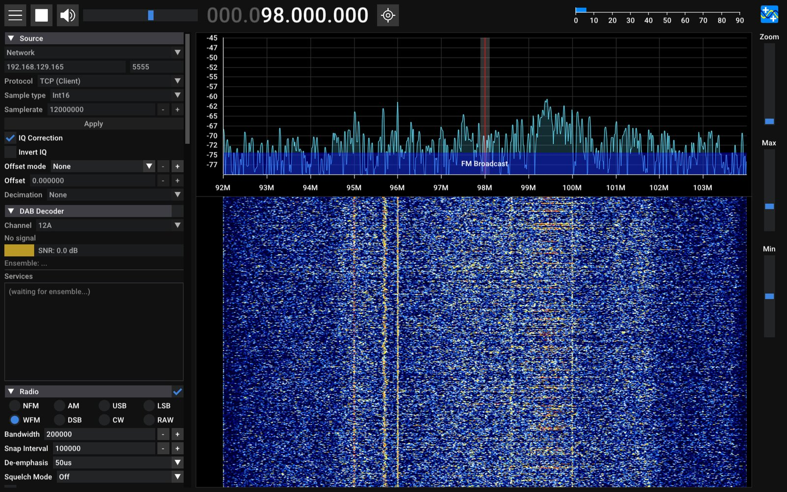

# Faster streaming: what was tried

**The question:** can the board stream one receiver to a PC at about 20 MS/s,
enough for a live 20 MHz view in SDR++, instead of the 11 MS/s it manages
through `iiod` today? Two faster paths were built and measured against the
stock one. **The answer is no:** the best path sustains 12 MS/s. This page
records what was measured, so nobody has to repeat it, and what does work.

`iiod` is the board's IIO server: the program SDR++, pyadi-iio, GNU Radio and
MATLAB talk to over the network. **DMA** is the FPGA hardware that moves
samples from the radio into the board's memory.

## The result

All three paths were measured the same way: RX2 only (4 bytes per sample), the
board on gigabit Ethernet, the PC on Wi-Fi, 12 s per rate timed over seconds
3 to 12, and a 60 s run at the highest passing rate. "Sustained" means at least
99.5% of the samples arrived over those 60 s.
[`tools/stream-paths/rx-rate.py`](https://github.com/matsvandamme/fishball7020-fpga-devkit/tree/main/tools/stream-paths)
repeats any of it.

| Path | Sustained RX2 | Highest rate seen | Board CPU at the limit | Works with today's apps |
|---|---|---|---|---|
| **Stock `iiod` 0.26** | **11 MS/s** (100% over 60 s; 12 MS/s gave 95.4%) | 44–46 MB/s | `iiod` at 90–100% of one core | yes |
| **libiio 1.0 `iiod`** | **11 MS/s** (12 MS/s gave 97.5% over 60 s) | 48–50 MB/s | `iiod` at 100% of one core | the 0.26 `iio_attr` and `iio_readdev` work against it unchanged; pyadi-iio and SDR++ use the same 0.26 library but were not tried |
| **`zc-stream`**, raw TCP | **12 MS/s** (99.9% over 60 s; 13 MS/s gave 96.7%) | 52–57 MB/s | `zc-stream` at 100% of one core | through SDR++'s Network Source, GNU Radio or a script; tuning stays in `iiod` |

For comparison, on the same board and network:

| | |
|---|---|
| Plain TCP from the board to the PC, no radio | 75 MB/s ≈ 19 MS/s |
| Capture on the board itself (`local:`), no network | 30.72 MS/s with no loss |
| Gigabit Ethernet's own limit for one receiver | about 29 MS/s |

## Why none of them gets further

**The limit is the board's CPU copying samples into the network**, not the
network and not the radio. Every path ends with one ARM Cortex-A9 core at 100%
while the second core has little to do, and the same board delivers 75 MB/s of
plain TCP over the same Wi-Fi.

- **`iiod` copies each sample twice**: from the DMA buffer into its own
  memory, then into the socket. One thread does both.
- **libiio 1.0** keeps several blocks in flight and can hand DMA buffers around
  by reference (DMABUF, which the 6.12 kernel supports and 5.15 does not). But
  its zero-copy path is for **USB only**: over the network it still copies each
  block into the socket, and the extra threads did not spread that over both
  cores. Whether DMABUF was used at all could not be confirmed.
- **`zc-stream`** reads the DMA blocks without copying (libiio maps them into
  the program) and copies once, into the socket. That buys one MS/s.
- **True zero-copy is not possible here.** Asking Linux to send the DMA block
  without copying it (`MSG_ZEROCOPY`) fails with `EFAULT`: the network stack
  cannot pin the radio's DMA memory. Bigger blocks, more blocks in flight and
  a larger socket buffer made `zc-stream` slower, not faster.

*`zc-stream` at 12 MS/s into SDR++'s Network Source: 12 MHz of the FM band
live, on the 1090 MHz antenna fitted to RX2 at the time.*

## What does work for more bandwidth

- **Send fewer samples.** The FPGA's ÷8 decimator filters in hardware and sends
  an eighth of the rate: up to 7.68 MS/s of clean bandwidth, well inside the
  limit ([SDR++](sdrpp.md#how-the-decimator-and-the-sample-rate-fit-together)).
- **Process on the board.** Code there reads 30.72 MS/s with `local:` and can
  send only its results ([your own project](your-own-project.md)).
- **Shrink each sample.** The radio's samples are 12 bits sent in 16, so
  packing them would save 25%, and 8-bit samples would halve the data at some
  cost in dynamic range. Neither was tried here.

## Using zc-stream anyway

It is the fastest of the three, by about 9%, and it is simple:
[`tools/stream-paths/zc-stream`](https://github.com/matsvandamme/fishball7020-fpga-devkit/tree/main/tools/stream-paths/zc-stream)
runs on the board and serves raw int16 I/Q over TCP. In SDR++, read it with
the **Network Source** (TCP client, the board's address, port 5555, Int16, the
rate you set). Tuning and gain still go through `iiod`, which is the catch: the
Network Source has no tuning or gain controls, so you set those with
`iio_attr` or another tool.

**Putting it inside our patched PlutoSDR source in SDR++**, so tuning stays in
SDR++, would mean the module keeping its libiio connection for control and
opening a TCP connection to `zc-stream` for the samples, with `zc-stream`
running as a service on the board. That is a modest change, but for one extra
MS/s it has not been worth making.

## Not tried

- **libiio 1.0 over USB.** Its DMABUF zero-copy path is the USB one, and USB is
  where the board is weakest today (about 5 MS/s). The test build had it
  switched off. It is the one libiio 1.0 experiment that could pay off.
- **A wired PC.** Every number here crossed Wi-Fi. The CPU limit applies either
  way, but a cable would show whether 12–13 MS/s is steadier without Wi-Fi's
  variation.
- **Packing 12-bit samples, or 8-bit samples.**
